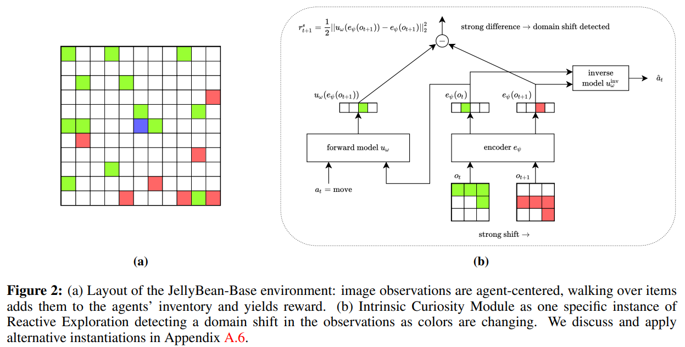

# Reactive Exploration to Cope with Non-Stationarity in Lifelong Reinforcement Learning
Christian Steinparz<sup>**2**</sup>, Thomas Schmied<sup>**1**</sup>, Fabian Paischer<sup>**1**</sup>, Marius-Constantin Dinu<sup>**1,3**</sup>, Vihang Patil<sup>**1**</sup>, Angela Bitto-Nemling<sup>**1,4**</sup>, Hamid Eghbal-Zadeh<sup>**1**</sup>, Sepp Hochreiter<sup>**1,4**</sup> 


<sup>**1**</sup>ELLIS Unit Linz and LIT AI Lab, Institute for Machine Learning, Johannes Kepler University Linz, Austria\
<sup>**2**</sup>Visual Data Science Lab, Institute of Compute Graphics, Johannes Kepler University Linz, Austria\
<sup>**3**</sup>Dynatrace Research, Linz, Austria\
<sup>**4**</sup>Institute of Advanced Research in Artificial Intelligence (IARAI), Vienna, Austria

This repository contains the source code for our paper **"Reactive Exploration to Cope with Non-Stationarity in Lifelong Reinforcement Learning"** accepted at [CoLLAs 2022](https://lifelong-ml.cc/).




[//]: # (---)

[//]: # ()
[//]: # (**This is the repository for the paper:)

[//]: # ([X]&#40;https://arxiv.org/abs/2205.12258&#41;.**)

[//]: # ()
[//]: # (**Detailed blog post on this paper at [this link]&#40;https://ml-jku.github.io/blog/2022/helm/&#41;.**)

[//]: # ()
[//]: # (---)

## Installation
[](https://www.python.org/downloads/release/python-390/)
[](https://pytorch.org/get-started/previous-versions/)


First, clone the repository and install the conda environment from the repository root (using either linux or windows config file): 
```
conda env create -f environment_linux.yaml
conda activate reactive_exploration 
```
Then follow the Jelly-Bean-World [installation instructions](https://github.com/eaplatanios/jelly-bean-world#installation-instructions). We use the following version:
```
git clone https://github.com/eaplatanios/jelly-bean-world.git
cd jelly-bean-world
git checkout 9bb16780e72d9d871384f9bcefd3b4e029a7b0ef
git submodule update --init --recursive
cd api/python
python setup.py install
```

From the project root directory install and update the submodule for ICM+PPO:
```
git submodule update --init --recursive
```

## Running experiments
This codebase relies on [Hydra](https://github.com/facebookresearch/hydra), which configures experiments via `.yaml` files. 
Hydra automatically creates the log folder structure for a given run, as specified in the respective `config.yaml` file.

### Running single experiments
By default, Hydra uses the configuration in `configs/config.yaml`. 
This config file defines how Hydra generates the directory structures for executed experiments under the block `hydra`. 

The  `config.yaml` contains the default parameters. The file references the respective default parameter files under the block
`defaults`. 

By default, `main.py` trains a PPO+ICM agent on the Colour-Swap task from the paper by referencing the environment configuration `configs/env_params/colour_swap.yaml` and agent configuration `configs/agent_params/icm.yaml`
To execute this configuration, run:
```
python main.py
```

For other configurations regarding agents and environments reference the files in `configs/`. For instance, to execute PPO+ICM on the Rotation task, run: 
```
python main.py env_params=rotator
```

Experiment logs are synced to [wandb](https://github.com/wandb/client). To execute experiments without wandb-logging, run:
```
python main.py use_wandb=False
```


### Running multiple experiments
All hyperparameters specified in the `.yaml` configuration files can be manipulated from the commandline. 
For example, to execute ICM and RND on the Colour-Swap task and Rotation task (`configs/env_params/rotator.yaml`) using 5 seeds, run: 
```
python -m main.py agent_params=icm,rnd env_params=colour_swap,rotator seed=1,2,3,4,5
```

## Citation

This paper has been accepted to the Conference on Lifelong Learning Agents (CoLLAs) 2022. While the conference proceedings do not yet exist, we recommend the following citation:

```bib
@misc{steinparz2022reactiveexp,
  title={Reactive Exploration to Cope with Non-Stationarity in Lifelong Reinforcement Learning},
  author={Steinparz, Christian and Schmied, Thomas and Paischer, Fabian and Dinu, Marius-Constantin and Patil, Vihang and 
          Bitto-Nemling, Angela and Eghbal-zadeh, Hamid and Hochreiter, Sepp},
  journal={arXiv preprint, accepted to Conference on Lifelong Learning Agents 2022},
  year={2022},
  eprint={X}
}
```


